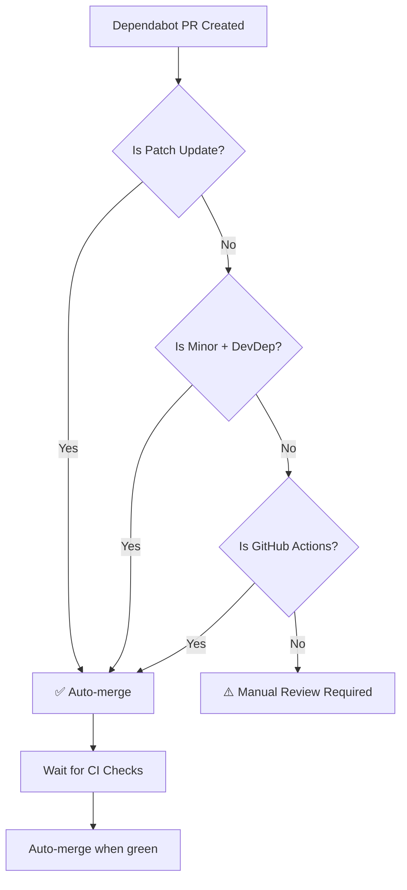

# Auto-Merge Dependabot PRs - Complete Guide

## 🎯 Overview

The auto-merge workflow automatically merges safe Dependabot pull requests after CI checks pass, while requiring manual review for potentially risky updates.

**Location:** `.github/workflows/auto-merge-dependabot.yml`

---

## 🔒 Safety Rules

### ✅ **Automatically Merged** (No Manual Review)

| Update Type | Dependency Type | Example | Risk Level |
|-------------|----------------|---------|------------|
| **Patch** | All dependencies | `19.2.0` → `19.2.1` | 🟢 Very Low |
| **Minor** | DevDependencies only | `@types/node: ^20` → `^21` | 🟡 Low |
| **GitHub Actions** | All versions | `actions/checkout@v3` → `@v4` | 🟢 Very Low |

### ⚠️ **Requires Manual Review**

| Update Type | Dependency Type | Example | Risk Level |
|-------------|----------------|---------|------------|
| **Major** | Production deps | `react: 19.x` → `20.x` | 🔴 High |
| **Minor** | Production deps | `next: 15.5.x` → `15.6.x` | 🟠 Medium |
| **Any** | Security-critical | `next-auth`, `prisma` | 🟠 Medium |

---

## 🚀 How It Works

### Workflow Trigger
```yaml
on:
  pull_request:
    types: [opened, synchronize, reopened]
```
- Runs when Dependabot creates or updates a PR
- Only activates if PR author is `dependabot[bot]`

### Decision Logic



### Safety Checks
1. ✅ **CI/CD must pass** - Linting, testing, building
2. ✅ **CodeQL scan must pass** - Security analysis
3. ✅ **Wait interval** - 10 seconds between check polls
4. ✅ **Squash merge** - Clean commit history

---

## 📊 What You'll See

### Auto-Merge Enabled (Safe Updates)
When a PR qualifies for auto-merge, you'll see:

**Comment from bot:**
```
🤖 Auto-merge enabled

Reason: Patch update (safe)
Update Type: version-update:semver-patch
Dependencies: react, react-dom

This PR will be automatically merged once all CI checks pass.
```

**Actions:**
- ✅ PR automatically approved
- 🔄 Auto-merge enabled (waits for CI)
- ✅ Merged automatically when checks pass
- 🗑️ Branch deleted automatically

### Manual Review Required (Risky Updates)
When a PR needs review, you'll see:

**Comment from bot:**
```
⚠️ Manual review required

Reason: Major version or production dependency - requires manual review
Update Type: version-update:semver-major
Dependencies: next

Review checklist:
- [ ] Check CHANGELOG for breaking changes
- [ ] Verify CI/CD passes
- [ ] Test locally if needed
- [ ] Run `npm audit` to check for vulnerabilities
```

**Actions:**
- 🔍 You review the PR
- ✅ You manually approve (or request changes)
- 🔀 You manually merge when ready

---

## 🎮 Managing Auto-Merge

### Disable Auto-Merge for Specific PR
If you want to review a PR that was auto-approved:

```bash
# Disable auto-merge
gh pr merge --disable-auto <PR_NUMBER>

# Or via GitHub UI:
# PR page → "Ready to merge" section → Click "Disable auto-merge"
```

### Emergency Stop
If something goes wrong during CI:

```bash
# Close the PR (stops auto-merge)
gh pr close <PR_NUMBER>

# Or disable auto-merge and investigate
gh pr merge --disable-auto <PR_NUMBER>
```

### Re-enable Auto-Merge
After making changes to a PR:

```bash
gh pr merge --auto --squash <PR_NUMBER>
```

---

## 🛠️ Configuration

### Adjust Safety Rules

Edit `.github/workflows/auto-merge-dependabot.yml`:

**Make auto-merge more aggressive (not recommended):**
```yaml
# Auto-merge ALL minor updates (including production deps)
if [ "$UPDATE_TYPE" = "version-update:semver-minor" ]; then
  echo "auto_merge=true" >> $GITHUB_OUTPUT
  exit 0
fi
```

**Make auto-merge more conservative:**
```yaml
# Only auto-merge patch updates for devDependencies
if [ "$UPDATE_TYPE" = "version-update:semver-patch" ] && [ "$DEP_TYPE" = "direct:development" ]; then
  echo "auto_merge=true" >> $GITHUB_OUTPUT
  exit 0
fi
```

### Change Merge Strategy

Current: **Squash merge** (clean history)
```yaml
gh pr merge --auto --squash "$PR_NUMBER"
```

Alternatives:
```yaml
# Merge commit (preserves all commits)
gh pr merge --auto --merge "$PR_NUMBER"

# Rebase (linear history)
gh pr merge --auto --rebase "$PR_NUMBER"
```

---

## 📈 Monitoring

### View Auto-Merge Activity

**GitHub UI:**
1. Go to **Actions** tab
2. Filter by workflow: "Auto-merge Dependabot PRs"
3. See which PRs were auto-merged vs. manual review

**Command Line:**
```bash
# List recent Dependabot PRs
gh pr list --author "app/dependabot"

# Check if PR has auto-merge enabled
gh pr view <PR_NUMBER> --json autoMergeRequest

# View workflow runs
gh run list --workflow="auto-merge-dependabot.yml"
```

### Weekly Report

Check your email for weekly Dependabot digest:
- ✅ Auto-merged PRs
- ⚠️ PRs awaiting review
- 🔒 Security updates

---

## 🔧 Troubleshooting

### Auto-merge not working

**Problem:** PR not merging even though CI passed

**Solutions:**
1. **Check branch protection rules:**
   - Settings → Branches → Branch protection rules
   - Ensure "Allow auto-merge" is enabled
   - Ensure required checks are configured correctly

2. **Check workflow permissions:**
   - Settings → Actions → General → Workflow permissions
   - Enable "Read and write permissions"

3. **Check if auto-merge is actually enabled:**
   ```bash
   gh pr view <PR_NUMBER> --json autoMergeRequest
   ```

### CI checks not triggering

**Problem:** Workflow waiting but no CI running

**Solution:**
```bash
# Re-run CI manually
gh pr checks <PR_NUMBER>

# Or close and reopen PR
gh pr close <PR_NUMBER>
gh pr reopen <PR_NUMBER>
```

### Wrong PRs being auto-merged

**Problem:** Production deps auto-merged unexpectedly

**Solution:**
1. Disable auto-merge immediately:
   ```bash
   gh pr merge --disable-auto <PR_NUMBER>
   ```

2. Review `.github/workflows/auto-merge-dependabot.yml` logic

3. Add explicit exclusions:
   ```yaml
   # Never auto-merge specific packages
   DEPS="${{ steps.metadata.outputs.dependency-names }}"
   if [[ "$DEPS" == *"next"* ]] || [[ "$DEPS" == *"react"* ]]; then
     echo "auto_merge=false" >> $GITHUB_OUTPUT
     exit 0
   fi
   ```

---

## 📚 Best Practices

### ✅ Do's
- ✅ Monitor auto-merged PRs weekly
- ✅ Check deployed app after auto-merges
- ✅ Review GitHub Actions logs occasionally
- ✅ Keep workflow updated with latest actions
- ✅ Test major updates locally before manual merge

### ❌ Don'ts
- ❌ Don't auto-merge without CI/CD in place
- ❌ Don't auto-merge if no tests exist
- ❌ Don't ignore manual review PRs for weeks
- ❌ Don't disable auto-merge workflow during high-traffic times
- ❌ Don't auto-merge database migration dependencies

---

## 🎓 Learning Resources

### Semantic Versioning (SemVer)
- **Patch** (1.2.**3** → 1.2.**4**): Bug fixes, no breaking changes
- **Minor** (1.**2**.3 → 1.**3**.0): New features, backward compatible
- **Major** (**1**.2.3 → **2**.0.0): Breaking changes

### GitHub Auto-Merge Docs
- [About auto-merge](https://docs.github.com/en/pull-requests/collaborating-with-pull-requests/incorporating-changes-from-a-pull-request/automatically-merging-a-pull-request)
- [Dependabot configuration](https://docs.github.com/en/code-security/dependabot/dependabot-version-updates/configuration-options-for-the-dependabot.yml-file)

---

## 📊 Expected Behavior

### Week 1 (October 7, 2025 - Monday)
Dependabot creates ~3-5 PRs:
- ✅ **Auto-merged:** `@types/*` patches, GitHub Actions updates
- ⚠️ **Manual review:** Next.js minor update, React updates

### Week 2-4
- ✅ Most PRs auto-merge (60-80%)
- ⚠️ 1-2 PRs need manual review per week

### Benefits
- ⏱️ **Time saved:** ~15 minutes per week
- 🔒 **Security:** Patches applied within hours
- 🎯 **Focus:** Only review risky updates

---

## 🚨 Emergency Contacts

If auto-merge causes production issues:

1. **Revert immediately:**
   ```bash
   git revert <COMMIT_SHA>
   git push origin main
   ```

2. **Disable workflow:**
   ```bash
   # Disable workflow temporarily
   gh workflow disable "auto-merge-dependabot.yml"
   ```

3. **Rollback deployment:**
   - Vercel: Go to Deployments → Click previous deployment → "Promote to Production"

---

## ✅ Setup Checklist

Before pushing this workflow:

- [ ] Read and understand safety rules above
- [ ] Ensure CI/CD workflow is working (`.github/workflows/ci-cd.yml`)
- [ ] Ensure branch protection rules allow auto-merge
- [ ] Verify workflow permissions (read + write)
- [ ] Test with a fake PR first (optional but recommended)
- [ ] Monitor first few auto-merges closely
- [ ] Add this guide to your Wiki or README

---

## 🎉 You're Ready!

The auto-merge workflow will start working as soon as you push it to GitHub.

**Next Dependabot PR (Monday, October 7):**
- 🤖 Workflow will analyze the PR
- ✅ Safe updates merge automatically
- ⚠️ Risky updates wait for your review
- 📧 You get notified either way

**Questions?** Check the troubleshooting section or disable auto-merge for specific PRs.

---

*Last updated: October 4, 2025*  
*Workflow version: 1.0*  
*Tested with: Next.js 15.5.4, Node.js 20+*
